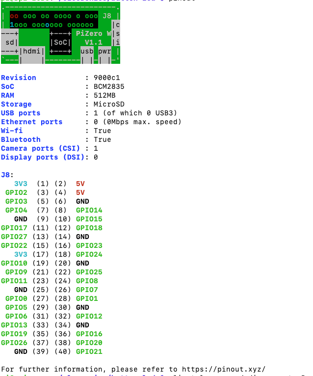
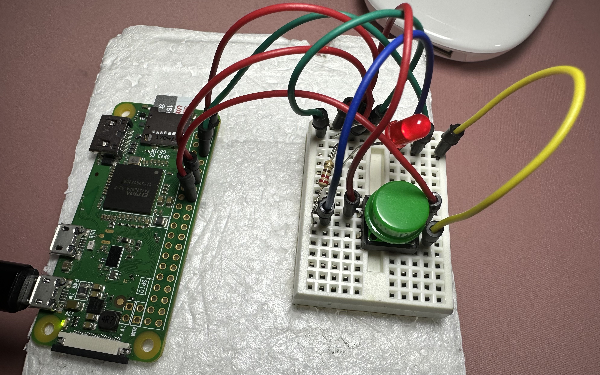
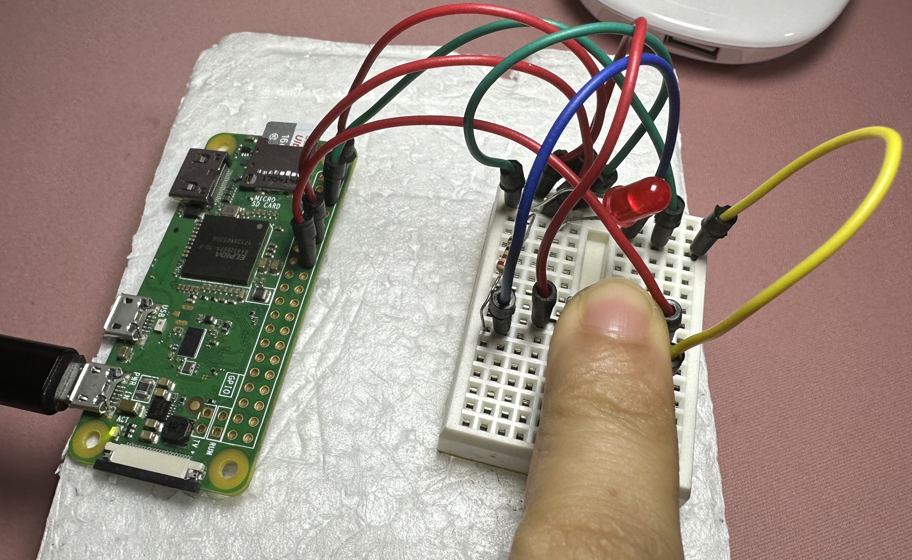

title: LED on and off on a button press using Raspberry Pi Zero
date: 2023-02-26 10:00
category: diy-rpi

#### <span style="color:#ff5f0e">Context of the problem:</span>
As an introduction to Raspberry Pi, I wanted to create a simple project that would turn on and off an LED on a button press.

I came across [this article](https://www.makeuseof.com/tag/add-button-raspberry-pi-project/) by Ian Buckley on [MUO - Technology Simplified](https://www.makeuseof.com/) and found this a good starting project.
I followed the steps with some modifications because I used a mini breadboard.

<span style="color:#ff5f0e">Hardware components used:</span>

- Raspberry Pi Zero W, 
- a mini breadboard,
- a button,
- a 220 Ohm resistor,
- an LED,
- jumper wires,
- lastly, a block of styrofoam to keep the jumper wires in place.

<span style="color:#ff5f0e">Software used:</span>

- Raspbian OS,
- Python 3 (and signal package),
- [GPIO Zero](https://gpiozero.readthedocs.io/en/stable/).
- [Raspberry Pi Imager](https://www.raspberrypi.org/software/)

#### <span style="color:#ff5f0e">Solution:</span>

##### <span style="color:#ff5f0e">A few steps to complete before your Raspberry Pi is ready:</span>

Raspberry Pi must be connected to a power supply and internet. The power source should be able to provide at least 1 Amp of current. The Raspberry Pi Zero W requires at least 1 Amp of current to run.
Flash the Raspberry Pi with the latest version of Raspbian OS. Create a user and configure ssh so that you can develop projects on a laptop and connect to Pi in headless mode.

##### <span style="color:#ff5f0e">Hardware setup:</span>

Once the Raspberry Pi is up and running, get the mini breadboard. These mini breadboards do not have a marked power rail. I used the top row of one of the sides as the positive and the other side as negative.
Next steps are easy:
Note: Since there are no soldering involved, I placed the Raspberry Pi on a tiny piece of styrofoam, so the jumper wires stay in place.
- Connect one of the 5V pins on the Raspberry Pi to the positive rail of the breadboard. Use a jumper wire. If you do not know the pin numbers, run `pinout` command in the terminal. You will get something similar to this:


- Connect one of the GND (ground) pins on the Raspberry Pi to the negative rail of the breadboard.
- Place the button in the middle of the mini breadboard. One side of the button is connected to the ground row, and the other side is connected to GPIO pin 16. Make sure the button is connected to the positive rail on both sides - this may not be needed on a full size breadboard.
- Place the LED on the mini breadboard. The positive side (the longer leg) of the LED is connected to pin 12 (GPIO 18).
- Place the 220 Ohm resistor on the mini breadboard. The resistor is connected between the negative side of the LED and the ground rail.
Once everything is connected, the LED should be lit up. If not, check the connections.

##### <span style="color:#ff5f0e">Software setup:</span>

- SSH into the Pi from computer.
- Create a new directory called `led-button` and create a new file called `led-button.py` in the directory. 
- Add the following script:
``` python
from gpiozero import LED, Button
from signal import pause

led = LED(18)
button = Button(23)

button.when_pressed = led.on
button.when_released = led.off

pause()
```

- Run the script using `python3 led-button.py` command.
- Press the button and the LED should turn off. Release and it will be on.
  
  

#### <span style="color:#ff5f0e">References:</span>
- https://www.makeuseof.com/tag/add-button-raspberry-pi-project/